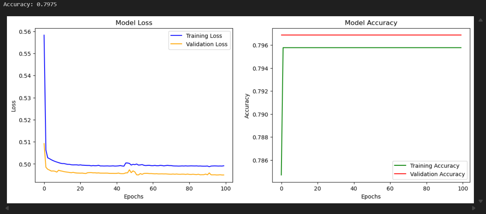
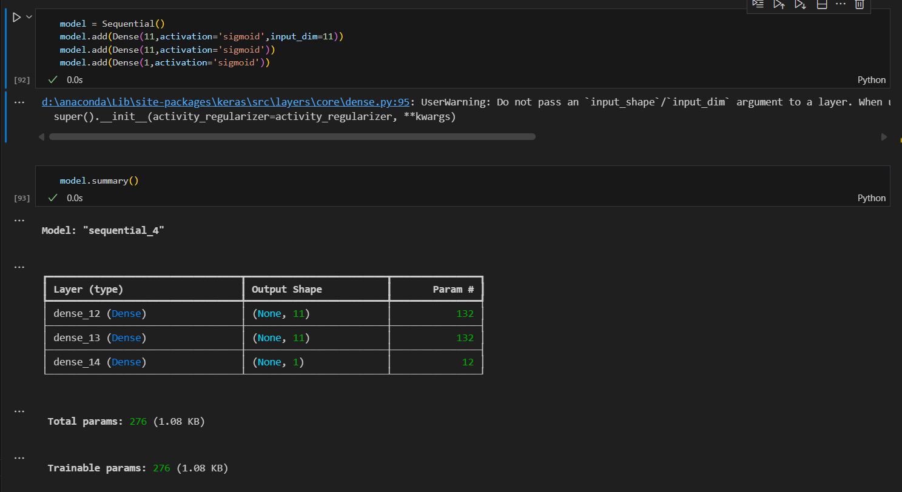

# 🧠 Customer Churn Prediction using Artificial Neural Network (ANN)

This project uses an **Artificial Neural Network (ANN)** to predict **customer churn** — whether a bank customer is likely to leave or stay — based on various customer attributes such as credit score, geography, gender, balance, and activity.

---

## 📊 Dataset
**Dataset:** `Churn_Modelling.csv`  
- Each row represents a bank customer with 14 attributes.  
- Target variable: **Exited (1 = Customer left, 0 = Customer stayed)**

**Key Columns:**
- `CreditScore`
- `Geography`
- `Gender`
- `Age`
- `Balance`
- `NumOfProducts`
- `IsActiveMember`
- `EstimatedSalary`
- `Exited` (Target)

---

## ⚙️ Tech Stack
- **Python**
- **TensorFlow / Keras**
- **Scikit-learn**
- **Pandas**
- **NumPy**
- **Matplotlib / Seaborn**

---

## 🧩 Steps Followed

1. Imported libraries and loaded `Churn_Modelling.csv`.  
2. Dropped unnecessary columns and encoded categorical features.  
3. Split data into train-test sets and applied `StandardScaler`.  
4. Built an ANN with 2 hidden layers (11 neurons each) and 1 output layer.  
5. Compiled using Adam optimizer and binary crossentropy loss.  
6. Trained the model for 100 epochs with validation split.  
7. Made predictions and converted them to binary outputs.  
8. Evaluated accuracy and plotted loss & accuracy curves.

